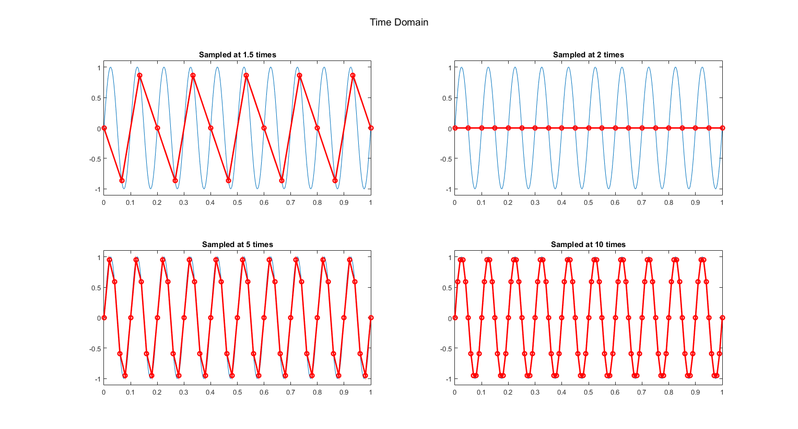
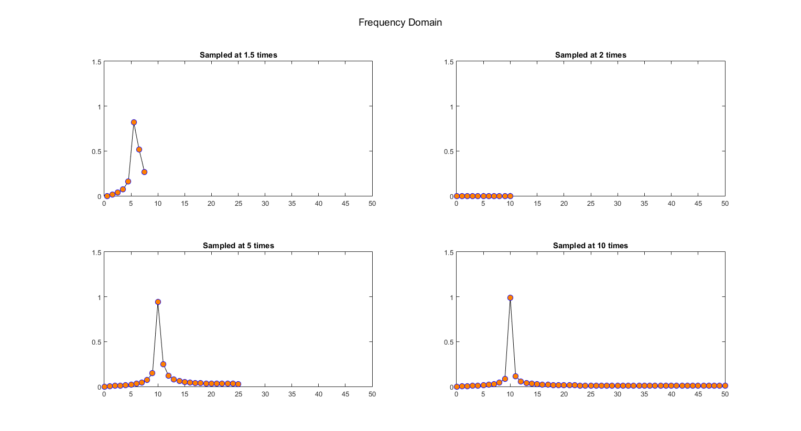

# Signals-and-Systems-Course-Assignments
The analysis of Discrete Fourier Transform, Nyquist Frequency and Aliasing, Non-stationary signals (Matlab and Mathematica)

### Definition of Delta Dirac Function

Any function $f(x, e)$ can be converted into Delta Dirac Function provided that:

1. $\lim_{e \to 0} \[ \int_{-\infty}^{\infty} f(x, e) \space dx \] = 1$

2. $\forall x \neq 0: \lim_{e \to 0} \[ f(x, e) \] = 0$

3. $\lim_{e \to 0} \[ f(0 , e) \] = \infty$

For example, a $\textbf{Gaussian distribution}$ whose variance converges to zero, or a rect function whose width converges to zero.

### Implementation of Discrete Fourier Transform from Scratch

$x(t) = sin(2\pi t + \frac{\pi}{4}) e^{-t^{2}}$

$x(t) = 1.5 + 2.5 sin(2\pi t)$

### Nyquist Frequency and Aliasing 

Choosing the correct sampling rate for retrieving a continuous signal (with regard to the frequency of the original continuous signal).

### Frequency Resolution 

The relation between a signal's frequency resoultion and simpaling rate (SR) and total number of points sampled from that signal (npts).

$Frequnecy Resolution = \frac{SR}{npts}$

### Non-stationary Signals Analysis (in Frequency Domain)

Signals whose attributes (Amplitude, Frequency, Phase, Edge Effect) change in time domain cannot be anayzed properly if ordinary Fourier transform is taken from them. So other methods should be applied on them (next section).

### Short Time FT, Hann Window, Welch Method

For taking Fourier transform from non-stationary signals, a window starts from the beginning of the signal and takes piece-wise FT, and the results are stacked. Because of the discontinuity that exists between windows in this method, the resultant FT is spiky; therefore, Hann window and Welch method are introduced.

